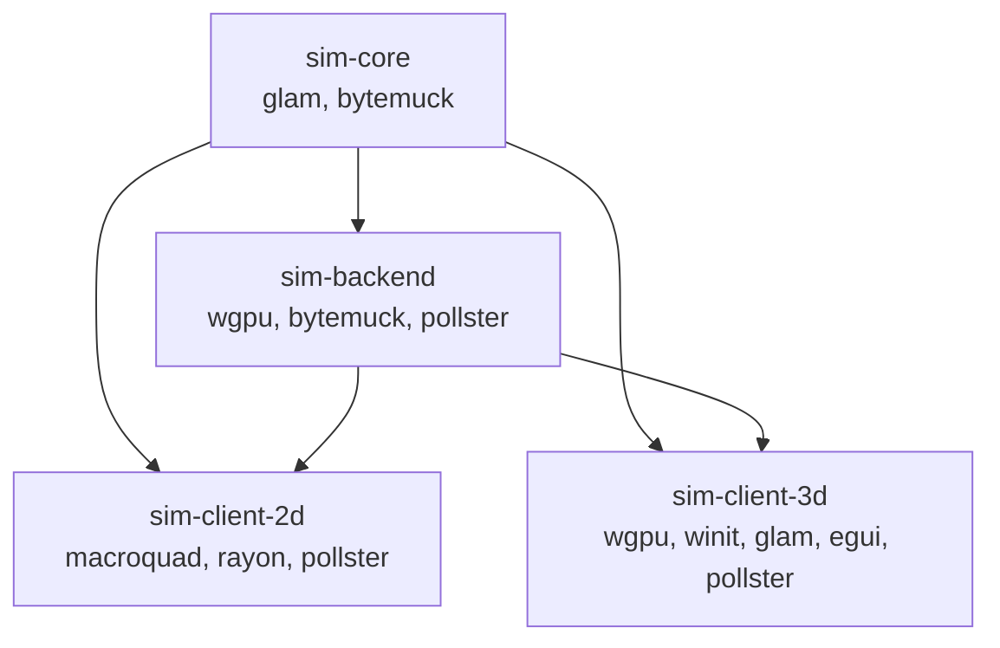

# CODE_REVIEW.md — Deepblue Hydraulic Sandbox Platform

**Review Date:** 2026-09-15  
**Scope:** Full codebase audit against `AGENTS.md` architecture specification  
**Focus:** Module decomposition, physics correctness, AGENTS.md compliance, test coverage

---

## Executive Summary

The deepblue codebase is **architecturally sound** and demonstrates strong adherence to the physics contracts defined in `AGENTS.md`. The simulation core is well-separated from rendering concerns, the GPU compute pipeline correctly implements double-buffered ping-pong execution, and the test suite comprehensively validates conservation laws, solver accuracy, and boundary conditions across both CPU and GPU backends.

The primary technical debt is **file-level monolithism**: three files concentrate too many responsibilities and should be decomposed into focused modules. Additionally, both client applications violate the temporal decoupling mandate by tying simulation sub-steps to frame rendering cadence.

### Severity Key
| Icon | Severity |
|------|----------|
| 🔴 | **Critical** — Architectural violation or correctness risk |
| 🟡 | **Moderate** — Maintainability or scalability concern |
| 🟢 | **Minor** — Polish or optimization opportunity |

---

## 1. File Size & Modularity Analysis

### Source File Line Counts (Rust + WGSL)

| File | Lines | Verdict |
|------|------:|---------|
| [`sim-backend/src/lib.rs`](file:///home/rpheuts/.distrobox/ubuntu/work/deepblue/sim-backend/src/lib.rs) | **1,694** | 🔴 Monolithic — needs aggressive splitting |
| [`sim-client-2d/src/main.rs`](file:///home/rpheuts/.distrobox/ubuntu/work/deepblue/sim-client-2d/src/main.rs) | **1,016** | 🔴 Monolithic — needs splitting |
| [`sim-core/src/lib.rs`](file:///home/rpheuts/.distrobox/ubuntu/work/deepblue/sim-core/src/lib.rs) | **717** | 🟡 Tests-only bloat — extract test module |
| [`sim-client-3d/src/main.rs`](file:///home/rpheuts/.distrobox/ubuntu/work/deepblue/sim-client-3d/src/main.rs) | 500 | 🟢 Acceptable |
| [`sim-core/src/scenario.rs`](file:///home/rpheuts/.distrobox/ubuntu/work/deepblue/sim-core/src/scenario.rs) | 445 | ✅ Clean |
| [`sim-core/src/solver/sediment.rs`](file:///home/rpheuts/.distrobox/ubuntu/work/deepblue/sim-core/src/solver/sediment.rs) | 331 | ✅ Clean |
| [`sim-core/src/boundary.rs`](file:///home/rpheuts/.distrobox/ubuntu/work/deepblue/sim-core/src/boundary.rs) | 315 | ✅ Clean |
| [`sim-core/src/solver/swe.rs`](file:///home/rpheuts/.distrobox/ubuntu/work/deepblue/sim-core/src/solver/swe.rs) | 286 | ✅ Clean |

---

## 2. Per-Crate Detailed Analysis

### 2.1. `sim-core` — Physics Kernel Library

**Module Structure:**
```
sim-core/src/
├── lib.rs         (11 lines of declarations + 707 lines of tests)
├── domain.rs      (SimDomainDescriptor)
├── state.rs       (GridState, DoubleBufferedGrid)
├── boundary.rs    (EdgeBoundary, DomainBoundaryConfig)
├── backend.rs     (SimulationBackend trait, CpuSimulator)
├── scenario.rs    (Pre-built scenarios)
└── solver/
    ├── mod.rs
    ├── swe.rs     (Shallow Water Equation solver)
    └── sediment.rs (Exner equation, talus collapse, infiltration)
```

**Verdict:** Module decomposition is **excellent**. Each file has a clear single responsibility. The solver implementations are stateless pure functions receiving buffers and parameters as mandated.

#### 🟡 Issue: `lib.rs` is 707 lines of tests in one block

Lines 1–11 are module declarations and re-exports. Lines 12–717 are a monolithic `#[cfg(test)] mod tests` block containing 12 test functions.

**Recommendation:** Extract tests to `sim-core/tests/integration.rs` (standard Rust integration test convention) or `sim-core/src/tests.rs` with `#[cfg(test)] mod tests;` include. This reduces `lib.rs` to ~11 lines and improves test discoverability.

#### 🟢 Issue: Positivity clamping creates potential mass drift

In [`solver/swe.rs`](file:///home/rpheuts/.distrobox/ubuntu/work/deepblue/sim-core/src/solver/swe.rs) (line 228), the update does `h_next = h_next.max(0.0)`. While this prevents negative depths, it silently creates mass from nothing when a cell underflows. Over millions of iterations at high velocities, this could cause slow mass drift.

**Recommendation:** Limit outgoing interface fluxes dynamically so a cell never drains more water than it possesses, rather than clamping after the fact.

#### 🟢 Issue: Talus collapse uses scatter pattern

In [`solver/sediment.rs`](file:///home/rpheuts/.distrobox/ubuntu/work/deepblue/sim-core/src/solver/sediment.rs), `step_talus_collapse` scatters material to neighbor cells via `grid.next.z_bed[neighbor_idx] += amount`. While this is correct and order-independent on a single-threaded CPU (reads come from `grid.current`), a scatter-add requires `atomicAdd` on GPU compute shaders. The GPU WGSL talus shader handles this correctly, but the CPU and GPU implementations diverge in pattern.

**Recommendation:** Consider reformulating the CPU talus pass as a **gather** operation (each cell calculates how much sand it *receives*) for 1:1 CPU/GPU algorithm parity.

---

### 2.2. `sim-backend` — GPU Compute Pipeline

**Current Structure:**
```
sim-backend/src/
├── lib.rs         (1,694 lines — EVERYTHING in one file)
└── shaders/
    ├── swe.wgsl              (539 lines)
    ├── sediment_exner.wgsl   (107 lines)
    ├── sediment_talus.wgsl   (108 lines)
    ├── sediment_sat.wgsl     (79 lines)
    ├── sediment_boundary.wgsl (51 lines)
    ├── export_textures.wgsl  (73 lines)
    └── brush.wgsl            (82 lines)
```

#### 🔴 Issue: `lib.rs` is a 1,694-line monolith mixing 6+ concerns

The single file conflates:

| Responsibility | Lines | Description |
|---|---|---|
| GPU uniform structs | 1–169 | `GpuStepParams`, `BrushParams` + boundary→GPU mapping |
| `WgpuSimulator` struct | 171–241 | 30+ fields spanning pipelines, buffers, textures, staging |
| GPU initialization | 243–699 | 450-line `from_device` creating 8 pipelines, 14 bind groups, 14 buffers |
| Compute execution | 700–1117 | `step`, `step_subdivided`, `export_textures`, `apply_brush` |
| Memory synchronization | 854–952 | `sync_to_cpu`, `upload_state`, `upload_water_depth` |
| Texture accessors | 1138–1204 | 15 getter methods |
| `SimulationBackend` impl | 1207–1273 | Trait delegation |
| Test suite | 1275–1694 | 8 GPU integration tests |

**Recommended refactored structure:**

```
sim-backend/src/
├── lib.rs           (~30 lines: module declarations + re-exports)
├── params.rs        (GpuStepParams, BrushParams, boundary→GPU mapping)
├── simulator.rs     (WgpuSimulator struct definition + field accessors)
├── init.rs          (from_device, new, new_sync — pipeline/buffer creation)
├── compute.rs       (step, step_subdivided, export_textures, apply_brush)
├── sync.rs          (sync_to_cpu, upload_state, upload_water_depth)
├── backend_impl.rs  (SimulationBackend trait implementation)
└── shaders/         (unchanged)
```

#### 🟡 Issue: Compute pass sequence duplicated between `step()` and `step_subdivided()`

The exact 6-pass sequence (SWE → Boundary → Saturation → Exner → Talus → Sediment Boundary) is copy-pasted between [`step()`](file:///home/rpheuts/.distrobox/ubuntu/work/deepblue/sim-backend/src/lib.rs#L772-L848) and the inner loop of [`step_subdivided()`](file:///home/rpheuts/.distrobox/ubuntu/work/deepblue/sim-backend/src/lib.rs#L1037-L1103).

**Recommendation:** Extract into a private helper:
```rust
fn enqueue_physics_passes(&self, encoder: &mut wgpu::CommandEncoder, pp: usize) { ... }
```

#### 🟢 Issue: Texture formats exceed spec requirements

`AGENTS.md` recommends `RG32_FLOAT` for `WaterMap` and `RG16_FLOAT` for `VelocityMap`. The implementation uses `Rgba32Float` for all maps (line 569–571). This is functionally correct but uses 2× the VRAM bandwidth for the water and velocity maps.

---

### 2.3. `sim-client-2d` — 2D Debug Visualizer

**Current Structure:**
```
sim-client-2d/src/
└── main.rs    (1,016 lines — everything in one file)
```

#### 🔴 Issue: Monolithic 1,016-line `main.rs` mixing 5+ concerns

| Responsibility | Approx. Lines | Description |
|---|---|---|
| Types & enums | 1–45 | `ActivePreset`, `FlowVisMode` |
| Camera system | 46–92 | `CameraState` struct + coordinate transforms |
| Flow particle system | 94–130 | `FlowParticle` struct + lifecycle management |
| Scenario management | 130–250 | Preset switching, GPU initializer calls |
| Input handling + tools | 254–516 | Mouse events, tool dispatch (`dig_trench`, `build_sand_dam`, `place_stone_wall`) |
| CPU optics renderer | 544–750 | Beer-Lambert extinction, caustics, Blinn-Phong specular, Fresnel, foam, wet sand |
| Flow visualization | 767–1016 | Tracer particles, velocity vector rendering, HUD overlay |

**Recommended refactored structure:**

```
sim-client-2d/src/
├── main.rs          (~150 lines: entry point, event loop)
├── camera.rs        (CameraState, coordinate transforms)
├── input.rs         (Tool dispatch, brush commands, scenario switching)
├── renderer.rs      (Beer-Lambert optics, surface normals, specular, foam)
├── flow_vis.rs      (FlowParticle, tracer advection, velocity vector drawing)
└── hud.rs           (Telemetry HUD overlay)
```

#### 🟡 Issue: Simulation logic leaks into presentation layer

In `main.rs` (lines 459–516), tool functions directly mutate `sim.current_state_mut().z_bed`, `h`, and `bedrock_z`. The presentation layer should dispatch abstract brush commands to the simulation backend rather than performing raw physical mass mutations.

#### 🔴 Issue: Temporal coupling — sim ticks tied to frame rate

In `main.rs` (lines 525–535), `current_sub_dt` is calculated using `get_frame_time()`. This directly paces the simulation according to frame rendering duration, violating `AGENTS.md` §4: *"Never tie simulation sub-steps to the display refresh rate."*

---

### 2.4. `sim-client-3d` — 3D Hydraulic Engine Client

**Current Structure:**
```
sim-client-3d/src/
├── main.rs          (500 lines — event loop, render orchestration)
├── camera.rs        (173 lines — orbit + isometric camera)
├── context.rs       (196 lines — wgpu surface/device setup)
├── mesh.rs          (222 lines — terrain/water mesh generation)
├── raycast.rs       (88 lines — heightfield picking)
├── passes/
│   ├── mod.rs
│   ├── terrain.rs   (171 lines — terrain render pass)
│   ├── water.rs     (198 lines — transparent water pass)
│   ├── decal.rs     (212 lines — brush cursor projection)
│   ├── skirt.rs     (139 lines — diorama skirt mesh)
│   └── ui.rs        (291 lines — egui telemetry panel)
└── shaders/
    ├── terrain.wgsl (238 lines)
    ├── water.wgsl   (377 lines)
    ├── decal.wgsl   (88 lines)
    └── skirt.wgsl   (69 lines)
```

**Verdict:** The 3D client is **well-structured** and demonstrates the modular render pass pattern that the 2D client should follow. Each rendering concern is cleanly isolated into its own pass module.

#### 🟡 Issue: Brush logic duplicated in client for CPU raycaster

In [`main.rs`](file:///home/rpheuts/.distrobox/ubuntu/work/deepblue/sim-client-3d/src/main.rs) (lines 348–386), the client duplicates brush falloff math and bedrock clamping to manually update `sim.cpu_grid.current.z_bed` alongside the GPU `apply_brush()` call. This is needed for CPU-side raycasting to stay in sync with GPU state.

**Recommendation:** Either:
- Add a targeted `sync_z_bed()` readback after brush operations, or
- Move the CPU array mutation utility to `sim-core` to avoid duplicating simulation math in the client.

#### 🔴 Issue: Temporal coupling — sim ticks tied to frame events

In [`main.rs`](file:///home/rpheuts/.distrobox/ubuntu/work/deepblue/sim-client-3d/src/main.rs) (lines 292–295), the simulation step occurs inside the `WindowEvent::RedrawRequested` block. If frame rate stutters, simulation frequency stutters. Neither client implements a fixed-timestep accumulator.

---

## 3. Dependency Architecture Audit

### Dependency DAG



### Compliance Check

| Rule | Status | Notes |
|------|--------|-------|
| `sim-core` has zero graphics/windowing deps | ✅ **Pass** | Only `glam` (math) and `bytemuck` (POD casting) |
| `sim-backend` depends only on `sim-core` + GPU compute | ✅ **Pass** | Only `sim-core`, `wgpu`, `bytemuck`, `pollster` |
| Clients depend on both `sim-core` and `sim-backend` | ✅ **Pass** | Both clients correctly wire both dependencies |
| Workspace uses resolver "2" | ✅ **Pass** | Modern Cargo feature resolution |
| No version conflicts | ✅ **Pass** | `bytemuck 1.15`, `glam 0.27`, `pollster 0.3` consistent |

---

## 4. AGENTS.md Compliance Matrix

### Architecture Principles

| Requirement | Status | Evidence |
|---|---|---|
| Decoupled Core vs. Presentation | ✅ **Pass** | `sim-core` compiles headless with zero graphics dependencies |
| Reference CPU backend | ✅ **Pass** | `CpuSimulator` implements `SimulationBackend` trait |
| GPU compute backend | ✅ **Pass** | `WgpuSimulator` with WGSL shaders via `wgpu` |
| Render Adapters consume read-only textures | ✅ **Pass** | Zero-copy `TextureView` exports; 3D client binds directly |
| Multi-Scale Fidelity (decoupled grid geometry) | ✅ **Pass** | Physical extents ($L_x, L_y$) fully decoupled from grid resolution ($\Delta x, \Delta y$) |
| Extensible Material Model | ✅ **Pass** | Layered stratigraphy with bedrock, configurable friction/cohesion params |
| Active Devices (Pumps/Gates) as boundary terms | ✅ **Pass** | `EdgeBoundary::WaveGenerator`, `ConstantInflow`, stream sources/sinks |

### Core Simulation Physics

| Requirement | Status | Evidence |
|---|---|---|
| **SWE (Saint-Venant equations)** | ✅ **Pass** | Audusse hydrostatic reconstruction + Rusanov fluxes, Manning friction |
| **Sediment Dynamics (Exner equation)** | ✅ **Pass** | Non-equilibrium pickup/deposition, capacity transport, suspended concentration advection |
| **Geotechnical Stability (Angle of Repose)** | ✅ **Pass** | Multi-neighbor iterative talus collapse with saturation-dependent φ |
| **SimDomainDescriptor `#[repr(C)]`** | ✅ **Pass** | Matches spec exactly with SI units |
| **GPU Texture Binding Contract** | ✅ **Pass** | `ElevationMap` (R32Float), `WaterMap`, `VelocityMap`, `SedimentWetnessMap` all exported |
| **Spatial Continuity (C⁰ heightfield)** | ✅ **Pass** | Scenarios use continuous profiles; no 1-cell discontinuities in solver outputs |
| **Temporal Decoupling (Tick ≠ Frame)** | ⚠️ **Partial** | Core supports it (`step_subdivided`); **both clients violate it** by tying dt to frame time |
| **Double-Buffered State** | ✅ **Pass** | `DoubleBufferedGrid` with `current`/`next`; GPU ping-pong `[0]/[1]` arrays |
| **Wave Breaking / Spray Metric** | 🟡 **Not yet** | Diagnostic triggers ($\nabla \cdot \vec{v}$, $\frac{\partial h}{\partial t}$) not yet exported as secondary channels |

### Conservation & Stability Constraints

| Requirement | Status | Evidence |
|---|---|---|
| **Strict Mass Conservation** | ✅ **Pass** | 12 CPU tests + 8 GPU tests validate < 10⁻³ mass drift |
| **CFL Condition Adherence** | ✅ **Pass** | `compute_max_stable_dt()` implements CFL formula; adaptive sub-stepping supported |
| **Positivity Preserving (h ≥ 0)** | ✅ **Pass** | Desingularized velocity formula `h·uh / (h² + h_dry²)`, depth clamping |
| **Bedrock Non-Erodibility** | ✅ **Pass** | `z_bed ≥ bedrock_z` enforced in both CPU and GPU sediment solvers |

### Verification & Testing

| Required Test | Status | Location |
|---|---|---|
| **Lake at Rest** | ✅ **Pass** | `test_lake_at_rest` — uneven bathymetry, velocities < 10⁻³ |
| **Dam-Break (Ritter)** | ✅ **Pass** | `test_dam_break_ritter_benchmark` — analytical comparison within 15% |
| **Sediment Conservation** | ✅ **Pass** | `test_sediment_mass_conservation` — relative error < 10⁻⁴ |
| **GPU Mass Conservation** | ✅ **Pass** | `test_wgpu_simulator_backend_trait`, `test_wgpu_sediment_conservation` |
| **GPU Scenario Stability** | ✅ **Pass** | `test_wgpu_beach_waves_scenario`, `test_wgpu_beach2_high_relief_scenario` |
| **Porous Infiltration** | ✅ **Pass** | `test_porous_infiltration_mass_transfer`, `test_wgpu_porous_infiltration` |
| **Talus Conservation** | ✅ **Pass** | `test_talus_collapse_conservation_and_repose` |
| **Boundary Conditions** | ✅ **Pass** | `test_wave_generator_boundary` |
| **Wind Forcing** | ✅ **Pass** | `test_wgpu_wind_forcing_momentum_transfer`, `test_wgpu_wind_turbulence_and_sheltering` |

**Total: 20 automated tests (12 CPU + 8 GPU), all passing.**

---

## 5. WGSL Shader Physics Review

### `swe.wgsl` (539 lines)
- **Scheme:** Audusse hydrostatic reconstruction with Rusanov (Local Lax-Friedrichs) numerical fluxes. Mathematically correct and well-balanced.
- **Positivity:** Desingularized velocity formula `(h * hu) / (h² + h_dry²)` prevents division-by-zero at wet/dry fronts.
- **Boundary Handling:** GPU-side Stokes wave generator with tidal oscillation and backwash absorption. Wind forcing includes divergence-free curl noise for turbulence and terrain sheltering.
- **Assessment:** ✅ Sound implementation.

### `sediment_exner.wgsl` (107 lines)
- **Conservation:** Strict Exner mass balance with `net_source_fluid = -dz * (1.0 - p)`.
- **Bedrock Limit:** `z_c + dz < bedrock` constraint prevents infinite scour.
- **Assessment:** ✅ Sound implementation.

### `sediment_talus.wgsl` (108 lines)
- **Repose Angles:** Saturation-dependent critical slope interpolation matching CPU implementation.
- **Assessment:** ✅ Sound implementation.

---

## 6. Prioritized Refactoring Recommendations

### Priority 1 — 🔴 Critical (Architecture violations)

| # | Issue | File | Action |
|---|---|---|---|
| **R1** | `sim-backend/src/lib.rs` monolith (1,694 lines, 6+ concerns) | [`lib.rs`](file:///home/rpheuts/.distrobox/ubuntu/work/deepblue/sim-backend/src/lib.rs) | Split into `params.rs`, `simulator.rs`, `init.rs`, `compute.rs`, `sync.rs`, `backend_impl.rs` |
| **R2** | `sim-client-2d/src/main.rs` monolith (1,016 lines, 5+ concerns) | [`main.rs`](file:///home/rpheuts/.distrobox/ubuntu/work/deepblue/sim-client-2d/src/main.rs) | Split into `camera.rs`, `input.rs`, `renderer.rs`, `flow_vis.rs`, `hud.rs` |
| **R3** | Temporal coupling in both clients | Both client `main.rs` | Implement fixed-timestep accumulator loop; use `State_previous` for frame interpolation |

### Priority 2 — 🟡 Moderate (Maintainability)

| # | Issue | File | Action |
|---|---|---|---|
| **R4** | Duplicated 6-pass compute sequence | [`sim-backend/src/lib.rs`](file:///home/rpheuts/.distrobox/ubuntu/work/deepblue/sim-backend/src/lib.rs#L772-L1103) | Extract `enqueue_physics_passes()` helper |
| **R5** | `sim-core/src/lib.rs` test block (707 lines) | [`lib.rs`](file:///home/rpheuts/.distrobox/ubuntu/work/deepblue/sim-core/src/lib.rs) | Move to `tests/integration.rs` |
| **R6** | Brush logic duplicated in 3D client | [`sim-client-3d/src/main.rs`](file:///home/rpheuts/.distrobox/ubuntu/work/deepblue/sim-client-3d/src/main.rs#L348-L386) | Add targeted `sync_z_bed()` or move CPU brush utility to `sim-core` |
| **R7** | 2D client tools directly mutate `GridState` | [`sim-client-2d/src/main.rs`](file:///home/rpheuts/.distrobox/ubuntu/work/deepblue/sim-client-2d/src/main.rs#L459-L516) | Route through abstract `BrushCommand` dispatch to backend |
| **R8** | Wave breaking / spray diagnostic triggers not yet exported | `sim-core`, `sim-backend` | Expose $\nabla \cdot \vec{v}$ and $\partial h / \partial t$ in a secondary texture channel |

### Priority 3 — 🟢 Minor (Polish)

| # | Issue | File | Action |
|---|---|---|---|
| **R9** | `h_next.max(0.0)` mass clamping in SWE solver | [`sim-core/src/solver/swe.rs`](file:///home/rpheuts/.distrobox/ubuntu/work/deepblue/sim-core/src/solver/swe.rs#L228) | Cap outgoing fluxes by available cell depth instead |
| **R10** | CPU talus scatter vs GPU gather pattern divergence | [`sim-core/src/solver/sediment.rs`](file:///home/rpheuts/.distrobox/ubuntu/work/deepblue/sim-core/src/solver/sediment.rs) | Consider gather-pattern reformulation for CPU/GPU parity |
| **R11** | Texture formats exceed AGENTS.md spec | [`sim-backend/src/lib.rs`](file:///home/rpheuts/.distrobox/ubuntu/work/deepblue/sim-backend/src/lib.rs#L569-L571) | Consider `RG32Float` for WaterMap and `RG16Float` for VelocityMap to reduce VRAM bandwidth |
| **R12** | 3D client `main.rs` input handling bloat | [`sim-client-3d/src/main.rs`](file:///home/rpheuts/.distrobox/ubuntu/work/deepblue/sim-client-3d/src/main.rs#L132-L230) | Extract `input.rs` module |

---

## 7. Overall Assessment

### Strengths
- **Physics correctness is excellent.** Conservation laws are rigorously validated. The SWE solver uses a proper well-balanced scheme (Audusse + Rusanov). Sediment dynamics correctly implement the Exner equation with strict mass coupling.
- **CPU/GPU parity.** Both backends implement the same `SimulationBackend` trait and are independently validated by parallel test suites.
- **Zero-copy architecture.** The `WgpuSimulator::from_device` constructor enables true shared-context VRAM texture exports for 3D renderers.
- **Test coverage is comprehensive.** 20 automated tests covering conservation, solver accuracy, scenario stability, boundary conditions, infiltration, and wind forcing.
- **The 3D client is a model of good structure** — demonstrating the pass-based modular rendering architecture that the other monolithic files should adopt.

### Weaknesses
- **Two monolithic files** (`sim-backend/src/lib.rs`, `sim-client-2d/src/main.rs`) need splitting. These are the most urgent refactoring targets.
- **Temporal decoupling violation** in both clients will cause simulation instability on machines with variable frame rates and prevents smooth interpolation on high-refresh displays.
- **No integration test directory.** All tests live inline in `lib.rs` files rather than in standard `tests/` directories.

### Roadmap Completion
All phases marked as complete in `AGENTS.md` (Phases 1–5 plus the Optimization milestone) are **verified as delivered** — the implementations match the claimed deliverables.
